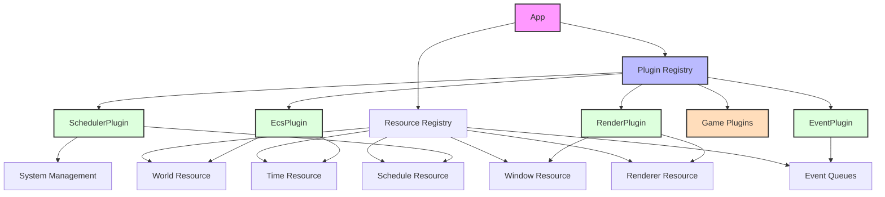
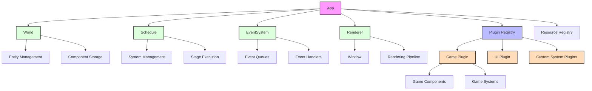
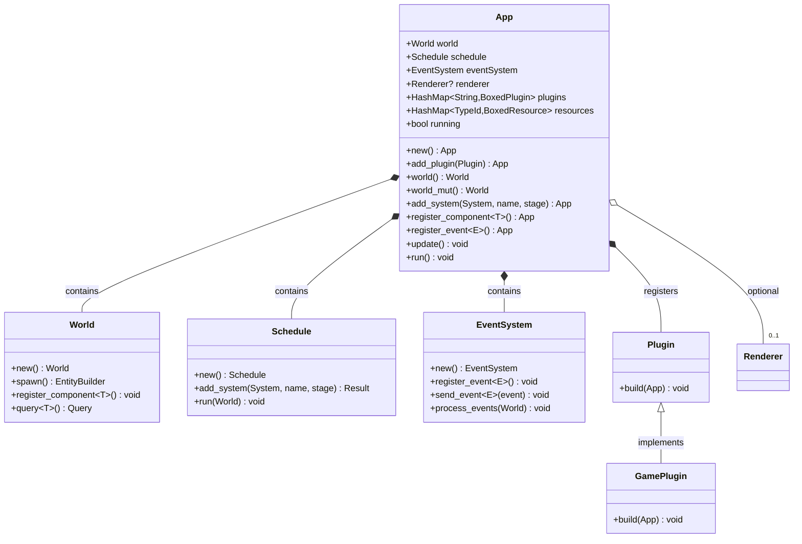

# Rustica Architecture Diagrams

This document presents visual diagrams of the current architecture and the proposed refactored architecture.

## Current Architecture

The current architecture implements everything as plugins, including core engine functionality:



### Current Issues

1. **Excessive Indirection**: Core functionality hidden behind plugins
2. **Circular Dependencies**: Plugins needing to know about each other
3. **Unclear Responsibilities**: No distinction between core and extension plugins
4. **Resource Management Complexity**: Components registered as resources

## Proposed Architecture

The refactored architecture directly incorporates core systems while keeping the plugin system for extensions:



### Key Improvements

1. **Direct Access**: Core systems directly accessible as App fields
2. **Clear Boundaries**: Distinction between engine fundamentals and plugins
3. **Simplified API**: Direct methods for common operations
4. **Better Performance**: Reduced indirection and overhead
5. **Focused Plugin System**: Plugins used only for true extensions

## API Comparison

### Before Refactoring

```rust
// Initialize app with plugins
let mut app = App::new();
app.add_plugin(EcsPlugin::default());
app.add_plugin(SchedulerPlugin::default());
app.add_plugin(RenderPlugin::default());
app.add_plugin(EventPlugin::default());

// Add game-specific plugin
app.add_plugin(MyGamePlugin);
```

### After Refactoring

```rust
// Core systems initialized automatically
let mut app = App::new();

// Configure core systems directly
app.register_component::<Position>();
app.add_system(move_system, "move", Stage::Update);

// Add only game-specific plugins
app.add_plugin(MyGamePlugin);
```

## Component Relationships



## File Organization

```
crates/
├── rustica/           # Main facade/prelude
├── rustica_core/      # Core App + Lifecycle
│   ├── app.rs         # App struct with direct core systems
│   └── plugin.rs      # Plugin trait for extensions
├── rustica_ecs/       # ECS implementation
│   ├── world.rs       # World implementation
│   └── component.rs   # Component trait
├── rustica_scheduler/ # Scheduler implementation
│   ├── schedule.rs    # Schedule implementation
│   └── system.rs      # System trait
├── rustica_event/     # Event system
├── rustica_render/    # Rendering (optional)
└── rustica_common/    # Shared utilities
